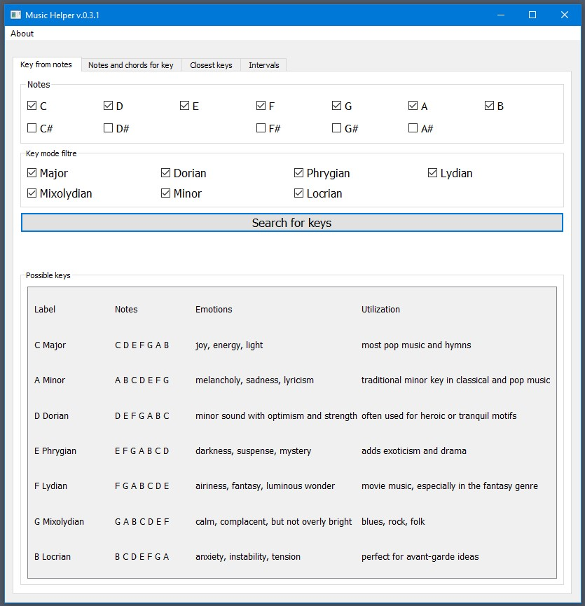
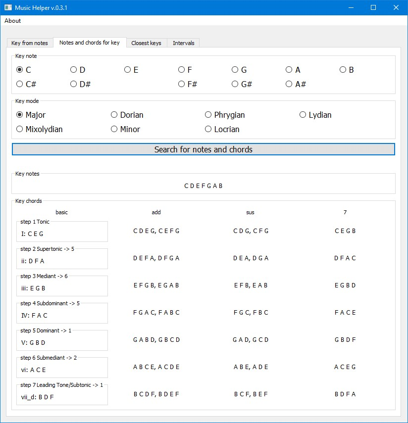
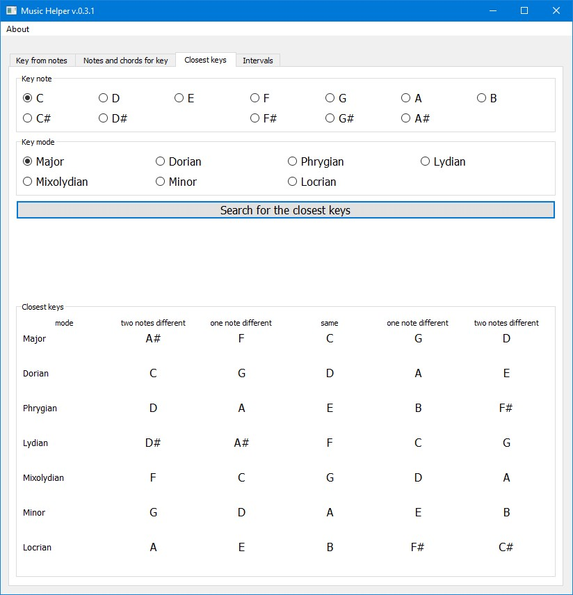
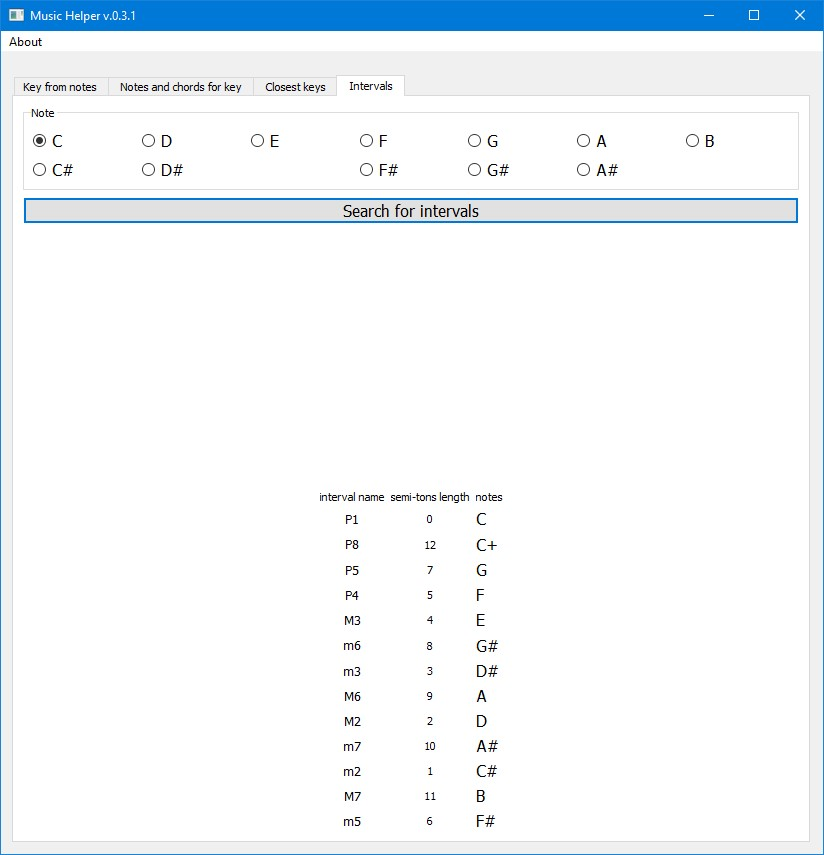

# **MusicHelper**

## **About the Project**
MusicHelper is a program designed to work with musical notes, keys, chords, modes, and intervals. 
Whether you're a music enthusiast, student, or professional, this tool provides a simple and intuitive way 
to analyze and explore musical concepts.

See **Features** section for more.

## **Download**
A compiled `.exe` for Windows is available in the [**Releases**](https://github.com/FlexStudia/MusicHelper/releases) section of this repository.
If you are on Linux or macOS, you can run the `.exe` using emulators:
- For **Linux**: Use **Wine** (`sudo apt install wine` on Ubuntu-based distributions).
- For **macOS**: Use [**Wine for macOS**](https://www.winehq.org/).

## **Features**
MusicHelper provides the following functionality:

1. **Key from notes**
Identify keys based on given musical notes.
2. **Notes and chords for key**
For a given key and root note, find matching chords.
3. **Closest keys**
This feature is close to the **Circle of Fifths**, allowing easy exploration of closely related keys.
Here we can find keys with:
    - **Identical notes**
    - **One note different**
    - **Two notes different**
4. **Intervals Exploration**
For any given note, list intervals in order from most consonant to most dissonant.

## **Screenshots**





## **How to Use the Source Code**
To clone and customize the Python code of MusicHelper, follow these steps:
1. Clone this repository:
``` bash
   git clone https://github.com/FlexStudia/MusicHelper.git
   cd MusicHelper
```
2. Install the dependencies (Python 3.8+ required):
``` bash
   pip install -r requirements.txt
```
3. Run the program from the code:
``` bash
   python main.py
```
4. Alternatively, you can modify the source code and compile your own version of the program with:
``` bash
   pyinstaller --onefile --noconsole main.py
```

## **Technical Details**
MusicHelper was created without relying on specialized libraries because there were no libraries offering all the required functionality in one place in a straightforward way. Developing a custom solution made it possible to keep the code flexible and fulfill all functional requirements.
The project uses a **modular structure** that separates the core functionality and the interface:
- `core.py` - contains essential logic and algorithms.
- `main.py` - implements the graphical interface using **PyQt**.

## **Questions / Contact**
For any bugs, improvement suggestions, or questions, please contact:
**Email**: flex.studia.help@gmail.com
If you'd like to contribute or report an issue, feel free to open an issue in this repository.

## **Project Status**
This project is **completed** but may receive updates or bug fixes as needed. 
Suggestions and feedback are always welcome, so feel free to reach out!

## **License**
This project is licensed under the [**AGPL-3.0**](https://www.gnu.org/licenses/agpl-3.0.html). 
See the [LICENSE](https://github.com/FlexStudia/MusicHelper/blob/main/LICENSE) file for details.
You can use the software freely, but any changes you make and distribute (or provide via network) must remain open and follow the same license.
